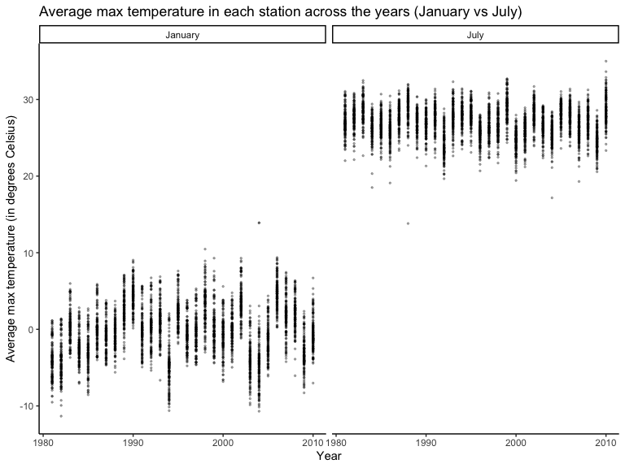

p8105_hw3_sjz2120
================
Sophie Zhang (sjz2120)
2022-10-09

# Problem 1

This problem uses the Instacart data. DO NOT include this dataset in
your local data directory; instead, load the data from the
`p8105.datasets` using:

``` r
library(p8105.datasets)
data("instacart")

instacart = 
  instacart %>% 
  as_tibble(instacart)
```

### Describing the Instacart dataset

This dataset contains a total of 1384617 rows and 15 columns, with each
row representing a single product from an instacart order.

Key variables include identifiers for each user, order, and product; the
order in which each product was added to the cart. There are several
order-level variables, describing the day and time of the order, as well
as number of days since prior order. There are also several
item-specific variables, describing the product name (e.g. Yogurt,
Avocado), department (e.g. dairy and eggs, produce), and aisle
(e.g. yogurt, fresh fruits), and whether or not the item has been
ordered by the specific user in the past.

In total, there are 39123 products found in 131209 orders from 131209
distinct users.

### Most popular aisles

-   How many aisles are there, and which aisles are the most items
    ordered from?

**There are 134 aisles in total, with most items ordered from the fresh
vegetables aisle followed closely by the fresh fruits aisle.**

``` r
instacart %>% 
  count(aisle) %>% 
  arrange(desc(n))
```

    ## # A tibble: 134 × 2
    ##    aisle                              n
    ##    <chr>                          <int>
    ##  1 fresh vegetables              150609
    ##  2 fresh fruits                  150473
    ##  3 packaged vegetables fruits     78493
    ##  4 yogurt                         55240
    ##  5 packaged cheese                41699
    ##  6 water seltzer sparkling water  36617
    ##  7 milk                           32644
    ##  8 chips pretzels                 31269
    ##  9 soy lactosefree                26240
    ## 10 bread                          23635
    ## # … with 124 more rows

### Plotting the number of items ordered in each aisle

This plot shows the number of items ordered in each aisle, limited to
aisles with more than 10000 items ordered. Aisles are arranged in
ascending order of the number of items ordered in that aisle:

``` r
instacart %>% 
  count(aisle) %>% 
  filter(n > 10000) %>% 
  mutate(aisle = fct_reorder(aisle, n)) %>% 
  ggplot(aes(x = aisle, y = n)) + 
  geom_point() + 
  labs(title = "Number of items ordered in each aisle") +
  theme(axis.text.x = element_text(angle = 60, hjust = 1))
```


### Table of most popular items from aisles: “baking ingredients”, “dog food care”, and “packaged vegetables fruits”

This table shows the three most popular items in each of the aisles
“baking ingredients”, “dog food care”, and “packaged vegetables fruits”.
The number of times each item is ordered is also included in this table,
and the rows are ordered by descending number of times each item is
ordered.

``` r
instacart %>% 
  filter(aisle %in% c("baking ingredients", "dog food care", "packaged vegetables fruits")) %>%
  group_by(aisle) %>% 
  count(product_name) %>% 
  mutate(rank = min_rank(desc(n))) %>% 
  filter(rank < 4) %>% 
  arrange(desc(n)) %>%
  knitr::kable()
```

| aisle                      | product_name                                  |    n | rank |
|:---------------------------|:----------------------------------------------|-----:|-----:|
| packaged vegetables fruits | Organic Baby Spinach                          | 9784 |    1 |
| packaged vegetables fruits | Organic Raspberries                           | 5546 |    2 |
| packaged vegetables fruits | Organic Blueberries                           | 4966 |    3 |
| baking ingredients         | Light Brown Sugar                             |  499 |    1 |
| baking ingredients         | Pure Baking Soda                              |  387 |    2 |
| baking ingredients         | Cane Sugar                                    |  336 |    3 |
| dog food care              | Snack Sticks Chicken & Rice Recipe Dog Treats |   30 |    1 |
| dog food care              | Organix Chicken & Brown Rice Recipe           |   28 |    2 |
| dog food care              | Small Dog Biscuits                            |   26 |    3 |

### Table of average hours of the day when Pink Lady Apples and Coffee Ice Cream are ordered, on each day of the week

-   This final table shows the mean hour of the day at which Pink Lady
    Apples and Coffee Ice Cream are ordered on each day of the week,
    formatted as a 2x7 table.

``` r
instacart %>%
  filter(product_name %in% c("Pink Lady Apples", "Coffee Ice Cream")) %>%
  group_by(product_name, order_dow) %>%
  summarize(mean_hour = mean(order_hour_of_day)) %>%
  spread(key = order_dow, value = mean_hour) %>%
  knitr::kable(digits = 2)
```

    ## `summarise()` has grouped output by 'product_name'. You can override using the
    ## `.groups` argument.

| product_name     |     0 |     1 |     2 |     3 |     4 |     5 |     6 |
|:-----------------|------:|------:|------:|------:|------:|------:|------:|
| Coffee Ice Cream | 13.77 | 14.32 | 15.38 | 15.32 | 15.22 | 12.26 | 13.83 |
| Pink Lady Apples | 13.44 | 11.36 | 11.70 | 14.25 | 11.55 | 12.78 | 11.94 |

# Problem 2

Accelerometers have become an appealing alternative to self-report
techniques for studying physical activity in observational studies and
clinical trials, largely because of their relative objectivity. During
observation periods, the devices measure “activity counts” in a short
period; one-minute intervals are common. Because accelerometers can be
worn comfortably and unobtrusively, they produce around-the-clock
observations.

This problem uses five weeks of accelerometer data collected on a 63
year-old male with BMI 25, who was admitted to the Advanced Cardiac Care
Center of Columbia University Medical Center and diagnosed with
congestive heart failure (CHF). In this spreadsheet, variables activity.
are the activity counts for each minute of a 24-hour day starting at
midnight.

### Loading, tidying, and wrangling the accelerometer dataset `accel_data`

Loading, tidying, and otherwise wrangleingthe data. The final dataset
`accel_data` includes all originally observed variables and values; has
useful variable names; includes a weekday vs weekend variable; and
encodes data with reasonable variable classes.

``` r
accel_data =
  read_csv(file = "./data/accel_data.csv") %>% #Read in csv file
  janitor::clean_names() %>% #Basic clean of dataset
  rename_with(.cols = starts_with("activity_"),
              .fn = ~ str_replace(string = .x, "activity_", "minute_")) %>% #Renamed all activity_* variables to minute_*
  mutate(type_of_day = recode(day, "Monday" = "Weekday", "Tuesday" = "Weekday", "Wednesday" = "Weekday", "Thursday" = "Weekday", "Friday" = "Weekday", "Saturday" = "Weekend", "Sunday" = "Weekend" )) %>% #Create new variable indicating weekday vs weekend
  select(week, day_id, day, type_of_day, everything()) #Reorganize columns so minute_* are at the end
```

    ## Rows: 35 Columns: 1443
    ## ── Column specification ────────────────────────────────────────────────────────
    ## Delimiter: ","
    ## chr    (1): day
    ## dbl (1442): week, day_id, activity.1, activity.2, activity.3, activity.4, ac...
    ## 
    ## ℹ Use `spec()` to retrieve the full column specification for this data.
    ## ℹ Specify the column types or set `show_col_types = FALSE` to quiet this message.

### Describing the cleaned & wrangled `accel_data` dataset

The cleaned and tidied dataset `accel_data` contains a total of 35 rows
and 1444 columns, with each row representing a single day of
accelerometer data (for each minute) for the subject. There are a total
of 5 weeks of data, with 7 days of data per week for a total of 35 total
days (days when accelerometer observations occured), with accelerometer
data for each minute of the day.

Key variables include `week` (the week during which the row data was
collected), `day_id` (an identifier for each of the 35 days that data
was collected for), and `day` (a label name for the day of the week); as
well as a newly created variable `type_of_day` (which indicates whether
the observation happened on a weekday vs weekend).

Other key variables include `minute_*` (renamed from `activity_*`) and
ranging from `minute_1` to `minute_1440`. The variables `minute_*` are
the activity counts for each minute of a 24-hour day starting at
midnight, hence why there are a total of 1440 `minute_*` variables
(because there are 1440 minutes in a day).

All of these variables are doubles, with the exception of the `day` and
`type_of_day` variables which are character variable types.

### Table with aggregated total daily activity per each day (`accel_data`)

Traditional analyses of accelerometer data focus on the total activity
over the day. Using your tidied dataset, aggregate across minutes to
create a total activity variable for each day, and create a table
showing these totals. Are any trends apparent?

``` r
accel_data %>%
  mutate(daily_activity = rowSums(accel_data[ , c(5:1444)], na.rm = TRUE)) %>%
  select(week, day_id, day, type_of_day, daily_activity) %>%
  knitr::kable()
```

| week | day_id | day       | type_of_day | daily_activity |
|-----:|-------:|:----------|:------------|---------------:|
|    1 |      1 | Friday    | Weekday     |      480542.62 |
|    1 |      2 | Monday    | Weekday     |       78828.07 |
|    1 |      3 | Saturday  | Weekend     |      376254.00 |
|    1 |      4 | Sunday    | Weekend     |      631105.00 |
|    1 |      5 | Thursday  | Weekday     |      355923.64 |
|    1 |      6 | Tuesday   | Weekday     |      307094.24 |
|    1 |      7 | Wednesday | Weekday     |      340115.01 |
|    2 |      8 | Friday    | Weekday     |      568839.00 |
|    2 |      9 | Monday    | Weekday     |      295431.00 |
|    2 |     10 | Saturday  | Weekend     |      607175.00 |
|    2 |     11 | Sunday    | Weekend     |      422018.00 |
|    2 |     12 | Thursday  | Weekday     |      474048.00 |
|    2 |     13 | Tuesday   | Weekday     |      423245.00 |
|    2 |     14 | Wednesday | Weekday     |      440962.00 |
|    3 |     15 | Friday    | Weekday     |      467420.00 |
|    3 |     16 | Monday    | Weekday     |      685910.00 |
|    3 |     17 | Saturday  | Weekend     |      382928.00 |
|    3 |     18 | Sunday    | Weekend     |      467052.00 |
|    3 |     19 | Thursday  | Weekday     |      371230.00 |
|    3 |     20 | Tuesday   | Weekday     |      381507.00 |
|    3 |     21 | Wednesday | Weekday     |      468869.00 |
|    4 |     22 | Friday    | Weekday     |      154049.00 |
|    4 |     23 | Monday    | Weekday     |      409450.00 |
|    4 |     24 | Saturday  | Weekend     |        1440.00 |
|    4 |     25 | Sunday    | Weekend     |      260617.00 |
|    4 |     26 | Thursday  | Weekday     |      340291.00 |
|    4 |     27 | Tuesday   | Weekday     |      319568.00 |
|    4 |     28 | Wednesday | Weekday     |      434460.00 |
|    5 |     29 | Friday    | Weekday     |      620860.00 |
|    5 |     30 | Monday    | Weekday     |      389080.00 |
|    5 |     31 | Saturday  | Weekend     |        1440.00 |
|    5 |     32 | Sunday    | Weekend     |      138421.00 |
|    5 |     33 | Thursday  | Weekday     |      549658.00 |
|    5 |     34 | Tuesday   | Weekday     |      367824.00 |
|    5 |     35 | Wednesday | Weekday     |      445366.00 |

**There don’t seem to be any noticeable trends in the aggregated amount
of daily activity (`daily_activity`). However, there do seem to be a few
days (without any noticeable patterns as to which days, except for the
two Saturdays in weeks 4 and 5) where daily activity is significantly
lower compared to other days.**

### Single-panel plot with 24-hour activity time courses for each day (`accel_data`)

Accelerometer data allows the inspection activity over the course of the
day. Make a single-panel plot that shows the 24-hour activity time
courses for each day and use color to indicate day of the week. Describe
in words any patterns or conclusions you can make based on this graph.

``` r
accel_pivot_data = 
  pivot_longer(
    accel_data, 
    minute_1:minute_1440,
    names_to = "minute", 
    names_prefix = "minute_",
    values_to = "activity_level") %>% #Create new dataframe from accel_data that has activity_level as it's own variable
  mutate(hour = as.numeric(minute)/60, day_id = as.character(day_id))


ggplot(accel_pivot_data, aes(x = hour, y = activity_level, color = day)) +
  geom_smooth(se = FALSE)
```

    ## `geom_smooth()` using method = 'gam' and formula 'y ~ s(x, bs = "cs")'


# Problem 3

This problem uses the NY NOAA data. DO NOT include this dataset in your
local data directory; instead, load the data from the `p8105.datasets`
package using:

``` r
library(p8105.datasets)
data("ny_noaa")

noaa = 
  ny_noaa
```

### Describing the NY NOAA (`noaa`) dataset

**Background**: The National Oceanic and Atmospheric Association (NOAA)
provides public access to some weather data, including the GHCN (Global
Historical Climatology Network)-Daily database of summary statistics
from weather stations around the world. GHCN-Daily contains records from
over 100,000 stations in 180 countries and territories. NCEI provides
numerous daily variables, including maximum and minimum temperature,
total daily precipitation, snowfall, and snow depth; however, about one
half of the stations report precipitation only. Both the record length
and period of record vary by station and cover intervals ranging from
less than a year to more than 175 years.

**Describing the Dataset**: The newly loaded `noaa` dataset contains a
total of 2595176 rows and 7 columns, with each row representing a single
day of observations/weather data for a specific weather station. There
are a total of 747 unique weather stations from where weather data was
collected, and the dates of the observations range from 1981-01-01 to
1981-01-01.

Key identifier variables include `id` (the weather station ID associated
with the specific row of data and `date` (date of observation). Other
key variables included the various weather measures such as `prcp`
(Precipitation (tenths of mm)), `snow` (Snowfall (mm)), `snwd` (Snow
depth (mm)), `tmax` (Maximum temperature (tenths of degrees C)), and
`tmin` (Minimum temperature (tenths of degrees C)).

Some of the rows/observations have missing values. In fact, let’s see
how many missing values there are for each weather data variable:

-   There are 145838 observations (proportion: 0.0561958) with missing
    values for the variable `prcp` (Precipitation (tenths of mm))

-   There are 381221 observations (proportion: 0.146896) with missing
    values for the variable `snow` (Snowfall (mm))

-   There are 591786 observations (proportion: 0.2280331) with missing
    values for the variable `snwd` (Snow depth (mm))

-   There are 1134358 observations (proportion: 0.4371025) with missing
    values for the variable `tmax` (Maximum temperature (tenths of
    degrees C)) – that’s nearly half of all observations that have
    missing values for `tmax`!

-   There are 1134420 observations (proportion: 0.4371264) with missing
    values for the variable `tmin` (Minimum temperature (tenths of
    degrees C)) – that’s nearly half of all observations that have
    missing values for `tmin`!

-   There are no observations with missing values for the variables `id`
    and `date` (thankfully!)

### Data cleaning the NY NOAA (`noaa`) dataset

Do some data cleaning. First we create separate variables for year,
month, and dayf. We also ensure that observations for temperature,
precipitation, and snowfall are given in reasonable units by dividing
the values for the temperature variables by 10 (changing from tenths of
degree Celsius to degrees Celcius), and by dividing the values for
precipitation and snowfall by 10 (changing from mm to cm).

``` r
noaa = noaa %>%
  janitor::clean_names() %>%
  mutate(year = lubridate::year(date),
         month = lubridate::month(date, label = TRUE, abbr = FALSE),
         day = lubridate::day(date)) %>% # Creating separate variables for year, month, and day
  mutate(prcp = prcp/10,
         snow = snow/10,
         snwd = snwd/10,
         tmax = as.numeric(tmax) / 10,
         tmin = as.numeric(tmin) / 10) %>% # Ensuring reasonable units for the weather data variables
  select(id, year, month, day, everything(), -date) # Rearranging variable order so the weather data variables come last

noaa
```

    ## # A tibble: 2,595,176 × 9
    ##    id           year month      day  prcp  snow  snwd  tmax  tmin
    ##    <chr>       <dbl> <ord>    <int> <dbl> <dbl> <dbl> <dbl> <dbl>
    ##  1 US1NYAB0001  2007 November     1    NA    NA    NA    NA    NA
    ##  2 US1NYAB0001  2007 November     2    NA    NA    NA    NA    NA
    ##  3 US1NYAB0001  2007 November     3    NA    NA    NA    NA    NA
    ##  4 US1NYAB0001  2007 November     4    NA    NA    NA    NA    NA
    ##  5 US1NYAB0001  2007 November     5    NA    NA    NA    NA    NA
    ##  6 US1NYAB0001  2007 November     6    NA    NA    NA    NA    NA
    ##  7 US1NYAB0001  2007 November     7    NA    NA    NA    NA    NA
    ##  8 US1NYAB0001  2007 November     8    NA    NA    NA    NA    NA
    ##  9 US1NYAB0001  2007 November     9    NA    NA    NA    NA    NA
    ## 10 US1NYAB0001  2007 November    10    NA    NA    NA    NA    NA
    ## # … with 2,595,166 more rows

### Most common observed snowfall totals

``` r
snow_count = noaa %>% count(snow) %>% arrange(desc(n))
snow_count$snow[1]
```

    ## [1] 0

**For snowfall, the most commonly observed values seem to be 0 followed
closely by NA, probably because there are many weather station locations
where it doesn’t snow at all (basically, anywhere where the climate is
mild/warm year-round or doesn’t support snowfall).**

### Two-panel plot of average max temperature in January and July, in each station across years (`noaa` dataset)

Make a two-panel plot showing the average max temperature in January and
in July in each station across years. First we get the data ready to be
used in a ggplot by filtering so only observations made in January and
July are kept, and creating a new variable of average max temperatures
(grouped by station id, year, and month). Then we use ggplot to create a
two-panel plot.

``` r
noaa %>% 
  filter(month == c("January", "July")) %>% # Only keep data collected in January and July
  drop_na(tmax) %>% # Drop observations missing tmax data
  group_by(year, month, id) %>% # Group data by year, month, and id
  summarise(mean_tmax = mean(tmax, na.rm = TRUE)) %>% # Create new variable for average max temperatures, grouped by station id, year, and month
  
  ggplot(aes(x = year, y = mean_tmax), group = id) + # Create a scatterplot of average max temperatures in each station across the years
  geom_point(size = 0.5, alpha = 0.3) +
  facet_grid(. ~ month) + # Two-panel plot separating January and July
  labs(title = "Average max temperature in each station across the years (January vs July)",
       x = "Year",
       y = "Average max temperature (in degrees Celsius)") +
  theme_classic()
```

    ## `summarise()` has grouped output by 'year', 'month'. You can override using the
    ## `.groups` argument.



It seems pretty clear that although there are variations in max
temperature within each year, across the years, and across different
weather stations, there is generally a clear average max temperature
difference between observations made in January vs July, with
temperatures in January hovering around 15-20 degrees Celsius lower than
average max temperatures in July across the years. Most of the January
average max temperatures fall below 10 degrees Celsius; while most of
the July average max temperatures fall above 20 degrees Celsius. There
are some outliers at both extremes for both the January and July data
across the years; for instance, in a few years both months have max
average temperatures which hover between 10-20 degrees Celsius
(relatively high for January and low for July). It’s difficult to tell
any overall trends in average max temperature across the years from
these plots, if only because there is still quite a bit of variation
within each year and between years.

### Plot of tmax and tmin (`noaa` dataset)

Make a plot showing (i) tmax vs tmin for the full dataset (note that a
scatterplot may not be the best option).

``` r
tmax_tmin = noaa %>% 
  ggplot(aes(x = tmin, y = tmax)) + 
  geom_hex() +
  labs(x = "Minimum temperature (C)",
       y = "Maximum temperature (C)",
       title = "tmax vs tmin") +
  theme_classic()

tmax_tmin
```


### Plot of snowfall distribution, separately by year (`noaa` dataset)

Make a plot showing the distribution of snowfall values greater than 0
and less than 100 separately by year.

``` r
snowfall = noaa %>% 
  filter(snow > 0 & snow < 100) %>%
  mutate(year = as.character(year)) %>% # Only keep snowfall values greater than 0 and less than 100
  ggplot(aes(x = snow, y = year)) +
  geom_density_ridges() +
  labs(title = "Snowfall distribution by year",
       caption = "For snowfall values greater than 0 cm and less than 100 cm",
       x = "Snowfall (cm)",
       y = "Year") +
  theme_classic()

snowfall
```

    ## Picking joint bandwidth of 0.622


### Two-panel plot of tmax vs tmin and snowfall distribution by year

Now we can combine the previous two plots, and create a two-panel plot
showing (i) tmax vs tmin for the full dataset (note that a scatterplot
may not be the best option); and (ii) make a plot showing the
distribution of snowfall values greater than 0 and less than 100
separately by year.

``` r
tmax_tmin_snowfall = (tmax_tmin + snowfall)
tmax_tmin_snowfall
```

    ## Picking joint bandwidth of 0.622


